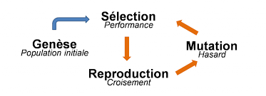

# ALGORITHME GENETIQUE

***

## Participants

> ### El Mehdi AAYADI
> - Projet WPF
> - toutes les interfaces graphiques réalisées
> - Sauvegarde des données dans **SQLite**
>
> ### Mamadou Saliou BAH
> - Projet Console (Algorithme et fonctionnement général)
> - tous les algorithmes ont réalisés
>

## Réalisations

| Tâches WPF                                                            | Réalisation    |
| :---                                                                  | :---           |
| écran de visualisation et d'édition des données                       | - [x] réalisé  |
| écran de paramétrage de la simulation                                 | - [x] réalisé  |
| écran de simulation de visualisation des générations successives      | - [x] réalisé  |
| sauvegarde des données dans **SQLite**                                | - [x] réalisé  |
| interface graphique devra être responsive                             | - [x] réalisé  |

| Tâches de la console                                                  | Réalisation    |
| :---                                                                  | :---           |
| Code d'obtention de la première génération                            | - [x] réalisé  |
| Code de CrossOver                                                     | - [x] réalisé  |
| Code de Mutation                                                      | - [x] réalisé  |
| Code de choix des Elites                                              | - [x] réalisé  |
| Sélection de la prochaine génération en boucle selon le nombre voulu  | - [x] réalisé  |